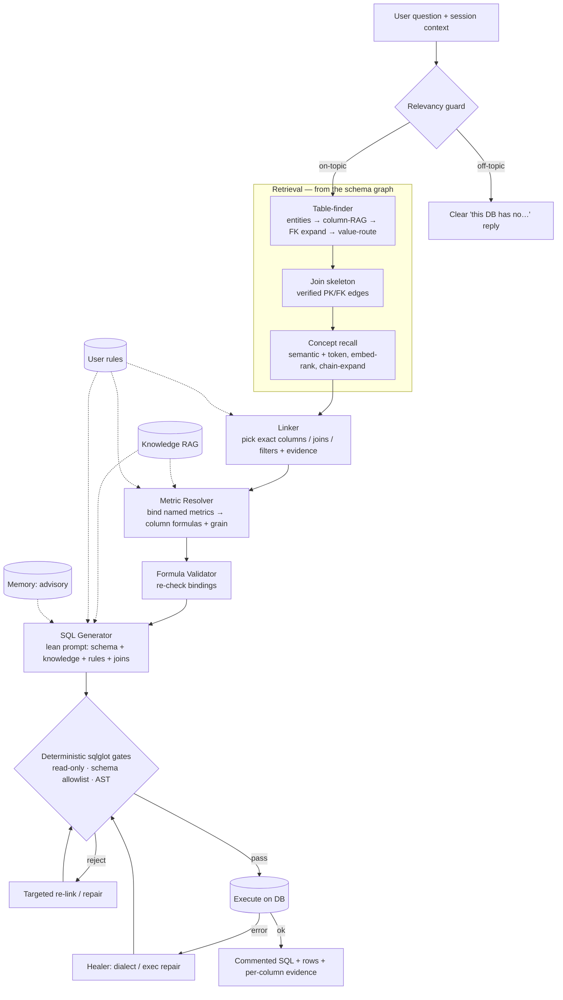
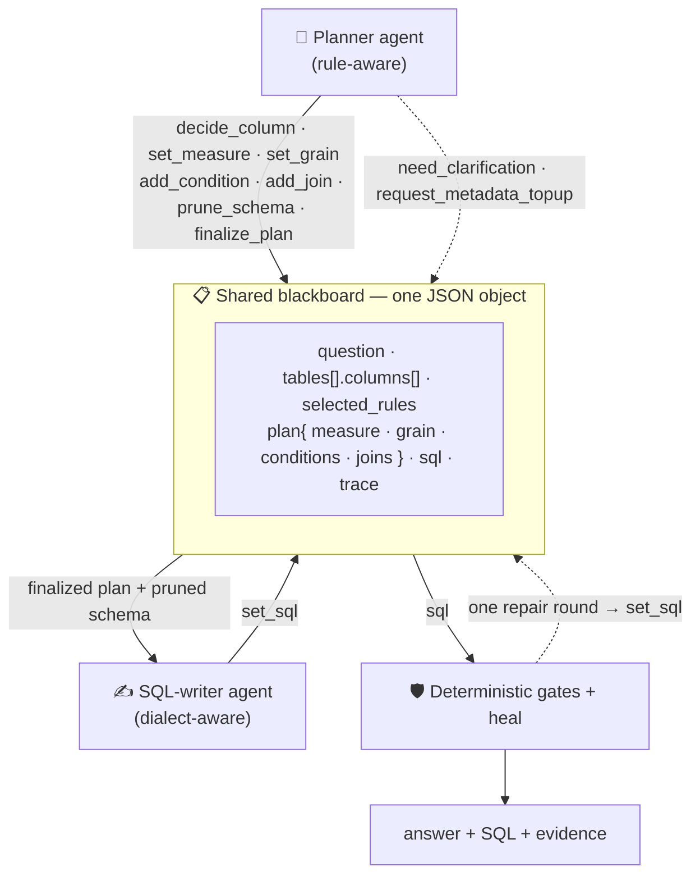
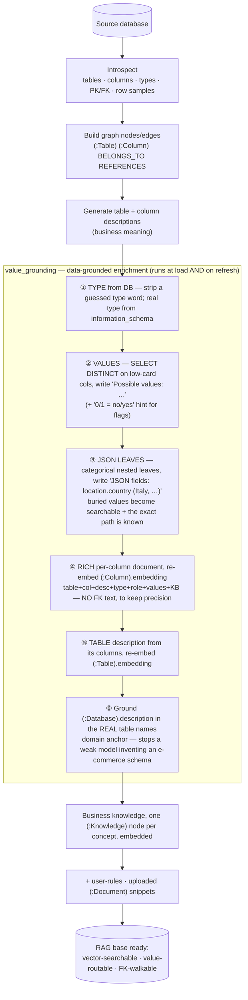

# 🏗️ T2S — Architecture

How T2S turns a natural-language question into one correct, read-only SQL
statement: the agents, the **JSON contract** they share, the graph database, how
the **RAG base is built and enriched**, and the features that keep it correct.

T2S is **graph-grounded** and **multi-agent**. Every agent gets the *minimum*
context it needs but information *sufficient* for its one job, all read from a
single shared FalkorDB schema graph. Prompts are **general** — no table/column
names, no SQL-dialect specifics — so the same pipeline works on any database.

---

## 1. Pipeline at a glance



On a reject/error the pipeline loops back **once** to a targeted re-link/heal —
never a blind full re-run.

---

## 2. Agent interaction & the shared JSON contract

Agents do **not** pass free text to each other. They share **one JSON object**
(the *blackboard*) and mutate it only through **typed tool calls** (LLM
function-calling), so every agent's output is valid by construction — no parsing
of model prose, no malformed handoffs.



**The blackboard object** (abridged — the real shape, here on the H1 ratio case):

```jsonc
{
  "question": "average keyword-hitting value for high-risk patterns, round to 3",
  "tables": [
    {
      "name": "communications", "status": "selected",
      "description": "Message threads between buyers, vendors and staff.",
      "columns": [
        { "name": "communication_details", "type": "jsonb",
          "key_type": "", "role": "measure", "status": "selected",
          "references_table": null, "references_column": null,
          "sample_values": ["{…}"],
          "description": "Per-message metrics. JSON fields: keyword_match_count (…), msg_count_total (…)." }
      ]
    }
  ],
  "selected_rules": [ { "id": "r3", "title": "Round only when a precision is stated" } ],
  "plan": {
    "measure":    { "concept": "Suspicion Signal Density",
                    "expr": "AVG((communication_details->>'keyword_match_count')::numeric / NULLIF((communication_details->>'msg_count_total')::numeric,0))",
                    "reason": "KB defines SSD = keyword_matches / total_messages (per-row ratio)" },
    "grain":      { "dimensions": [], "reason": "single scalar over all rows" },
    "conditions": [],
    "joins":      []
  },
  "sql": "SELECT ROUND(AVG(...),3) AS avg_ssd FROM communications"
}
```

**The tool calls** that produce it — each carries its justification and the
`rule_ids` it followed, which is what makes decisions auditable:

```jsonc
// Planner phase
decide_column { "decision":"select", "role":"measure", "table":"communications",
                "column":"communication_details", "reason":"holds keyword + message counts", "rule_ids":["kb"] }
set_measure   { "expr":"AVG(.../NULLIF(...,0))", "concept":"Suspicion Signal Density", "reason":"…", "rule_ids":["kb"] }
set_grain     { "dimensions":[], "reason":"one scalar", "rule_ids":[] }
add_condition { "column":"…", "op":"=", "value":"Active", "reason":"…", "rule_ids":[] }
add_join      { "left":"a.fk_col", "right":"b.pk_col", "reason":"verified FK edge", "rule_ids":[] }
need_clarification     { "blocking_missing_info":[…], "questions":[…], "reason":"2 sources, none picked by wording" }
request_metadata_topup { "missing_tables":[…], "missing_columns":[…], "blocking":true }
// SQL phase
set_sql       { "sql":"SELECT ROUND(AVG(...),3) FROM communications" }
```

> The classic pipeline (§5) passes the same fields as discrete agent
> inputs/outputs; the blackboard is the unified shared-JSON variant. Both honour
> *minimal context per agent* — an agent never sees fields it doesn't need.

---

## 3. The schema graph (FalkorDB)

The single source of truth, built once at **index time** from the live DB (plus
any uploaded docs + business knowledge) and embedded with the current model.

| Node / edge | Holds |
|---|---|
| `(:Table)` | name, business **description**, vector **embedding** |
| `(:Column)` | name, type, nullable, key_type (PK/FK), **description**, **sample_values**, vector **embedding** |
| `(:Column)-[:BELONGS_TO]->(:Table)` | column → table |
| `(:Column)-[:REFERENCES]->(:Column)` | declared foreign key (the verified join graph) |
| `(:Knowledge)` | one node **per business concept/metric**, embedded for semantic recall |
| `(:Document)` | uploaded schema/DDL snippets, embedded |
| `(:Database)` | `description` grounded in the real table names + URL |
| `(:AppSettings)` | per-user runtime overrides (model, temperature, …) |

---

## 4. Building & enriching the RAG base (index time)

A from-scratch index is **idempotent** and **data-grounded** — descriptions,
values, JSON paths and the DB description all come from the real database, so the
retriever works on an **unseen** schema instead of hallucinating a generic one.



Re-index is **crash-safe** (backup → drop → re-pull → restore on failure) and
preserves uploaded documents, knowledge, and user-rules.

---

## 5. Agents and their jobs

Each agent is a focused LLM (or deterministic) step; most emit JSON via tool/
function-calling, so output is valid by construction.

| Agent (`api/agents/…`) | Role | Produces |
|---|---|---|
| **RelevancyAgent** | Guard: answerable from this DB? | on/off-topic + reason |
| **Table-finder** `graph.find()` | Recall candidate tables (entity → column-RAG → FK expand → value-route) | ranked tables (+ columns) |
| **MemoryAgent** | Advisory: similar prior questions | example prior queries (non-authoritative) |
| **LinkerAgent / Planner** | Pick exact columns / joins / filters + evidence | a schema-link **plan** |
| **MetricResolverAgent** | Bind a *named* metric → column formula + grain | resolved formulas (column-bound) |
| **FormulaValidatorAgent** | Re-check a resolved formula's column bindings | corrected bindings |
| **BusinessRuleRagAgent** | Retrieve relevant business knowledge | focused concept set |
| **AnalysisAgent (Generator) / SQL-writer** | Write the one read-only SQL | SQL (+ evidence) |
| **SQL gate** `gate_registry` | Deterministic sqlglot-AST validation | accept / precise rejection |
| **FilterValidatorAgent** | Drop unjustified WHERE/HAVING predicates | trimmed SQL |
| **Ratio-formula gate** `ratio_formula_gate` | Enforce a resolved ratio (AVG(num)→AVG(num/den)) | corrected SQL |
| **SchemaTopupAgent** | Fetch a missing column from the graph on demand | extra columns |
| **HealerAgent** | Repair a dialect/execution error | fixed SQL (execute→heal) |
| **ResponseFormatterAgent** | Commented-SQL render + result shaping | commented SQL + rows + evidence |
| **FollowUpAgent** | Resolve follow-ups via session context | standalone question |

---

## 6. Key features

- 🧩 **Graph-grounded retrieval** — rich per-column embeddings + FK-walk; finds the
  right table/column on schemas it has never seen.
- 🗄️ **Data-grounded indexing** — types, values, JSON-leaf paths and the DB
  description are all pulled from the **real** database at index time.
- 🎯 **Value-routing + FK-neighbour surfacing** — a literal (`Italy`) routes to the
  column whose domain holds it; a join partner ranked low by the embedder is still
  pulled in via the FK edge.
- 🧠 **Semantic KB-concept recall + ratio-formula adherence** — a metric named by
  *meaning* is recalled (not just by name), and a ratio is applied as a mean of
  per-row ratios — deterministically, even on a weak model.
- 🛡️ **Deterministic sqlglot gates (no regex)** — read-only enforcement, schema
  allowlist, JSON paths, CamelCase quoting, case-fold, integer division,
  NULLS-LAST — then an execute→heal loop.
- 🔗 **Typed tool-call contract** — agents share one JSON and mutate it via typed
  tools, so handoffs can't be malformed; every decision carries its `rule_ids`.
- 🌍 **Multilingual** — entity extraction + a country/demonym normalizer bridge a
  question in any language to an English schema.
- 🏠 **Fully local & idempotent** — Docker, bundled CPU embeddings, from-scratch
  index reproduces the exact graph.

---

## 7. Two design choices that drive correctness

**Lean generation ("direct-gen").** A capable model gets a *clean, minimal* prompt
(pruned schema + focused knowledge chain + user-rules + verified joins + the
question). A bloated prompt *raises* the error rate, so pre-bindings are not forced
in this mode — except a **ratio/composite formula**, which is injected because a
weak model otherwise drops the denominator.

**Deterministic gate, not a regex.** Validation is pure `sqlglot` AST work; a
rejection returns a precise diff that drives one targeted re-link/repair — the
model never "guesses again" blindly.

---

## 8. Memory & input delivery

`MemoryAgent` supplies **advisory** prior-query examples (off by default,
never overrides schema/knowledge/rules). Each input is delivered to exactly the
agents that need it: **schema** → finder/linker/resolver/generator (each its
slice); **knowledge** → resolver + generator (chained metrics expanded);
**user-rules** → linker/resolver/generator; **verified joins** → generator
(scoped) + gate (full set); **session context** → follow-up + generator.

See [`README.md`](README.md) to add a DB / knowledge / rules, and
[`tests.md`](tests.md) for verified results.
