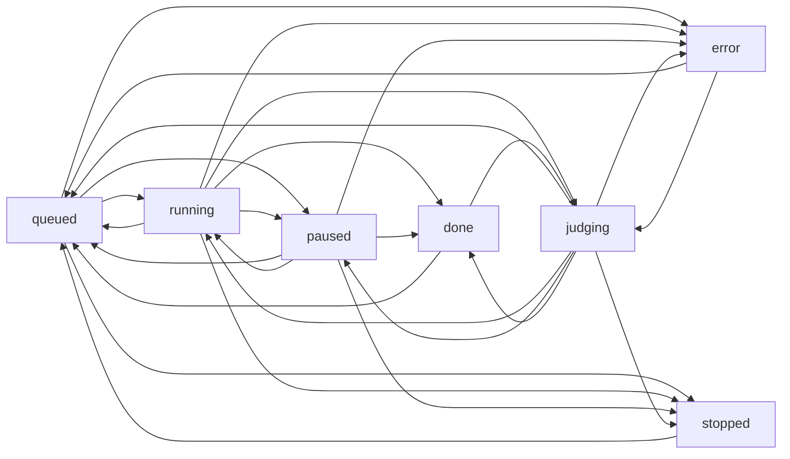
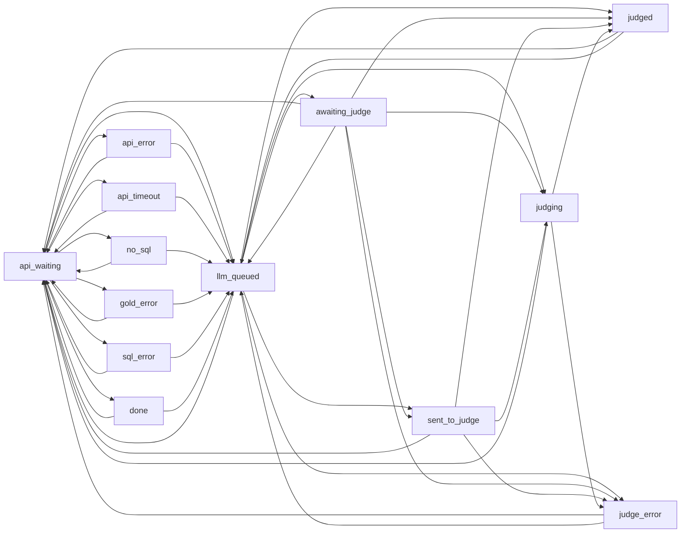
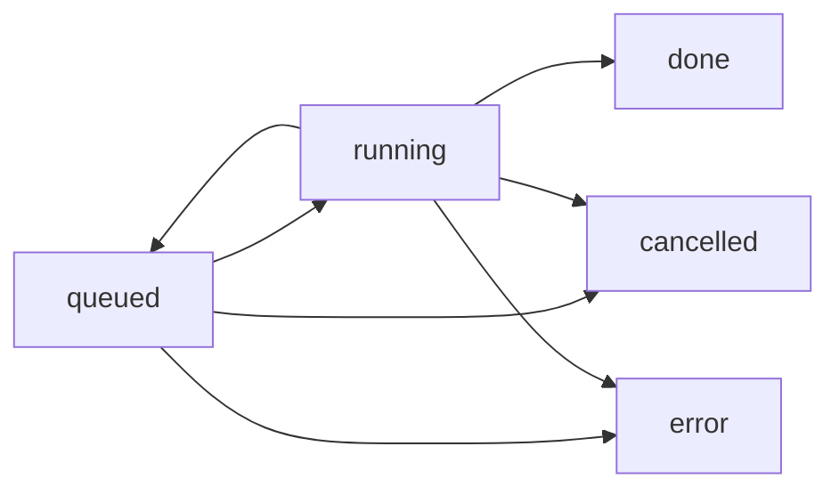

# Benchmark State Graph

Authoritative code contract: `bench_app/state_graph.py`.

This document describes legal status transitions for benchmark runs, individual
cases, and durable worker jobs. Same-state updates are allowed everywhere:
workers often refresh counters or timestamps without changing the status.

## Run Statuses

- `queued`: the run is waiting for inline execution or a worker job.
- `running`: connector API and scoring SQL collection are active.
- `paused`: user pause or circuit breaker pause.
- `judging`: LLM judging is active.
- `done`: finished successfully.
- `error`: failed and needs user action or rerun.
- `stopped`: stopped by user or cancellation.

Important rule: a stopped run must not go directly to `running`. Any rerun or
case rerun must go through `queued` first.

## Case Statuses

- `api_waiting`: waiting for connector API.
- `done`: collected without LLM judge.
- `llm_queued`: collected and waiting for LLM judge capacity.
- `awaiting_judge`: compatibility label for a collected case waiting on judge.
- `sent_to_judge`: request to LLM judge was sent.
- `judging`: LLM judge is currently evaluating.
- `judged`: final L0-L4 level is ready.
- `api_error`, `api_timeout`, `no_sql`, `gold_error`, `sql_error`: connector,
  scoring, or SQL collection outcome before judging.
- `judge_error`: LLM judge failed.

Collection errors may still transition to `llm_queued`: the judge must classify
real L0/L1/L2 outcomes instead of hiding them.

## Worker Job Statuses

- `queued`: job is waiting for a worker.
- `running`: job is claimed by a worker and heartbeating.
- `done`: job finished.
- `error`: job failed.
- `cancelled`: job was cancelled by user/worker shutdown.

Watchdog recovery is the only normal path from `running` back to `queued`.

